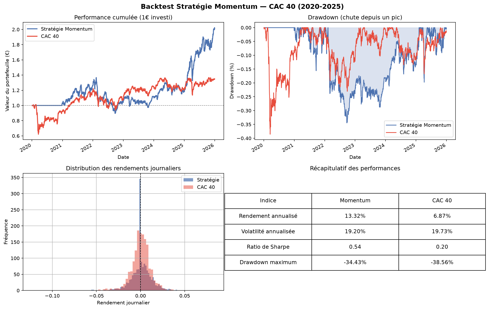

# Momentum Strategy Backtest / CAC 40 (2020-2025)

Backtest d'une stratégie momentum sur 10 valeurs du CAC 40, comparée au benchmark CAC 40 sur 6 ans de données réelles.

## Méthodologie

- Univers : 10 grandes valeurs du CAC 40 (BNP, LVMH, TotalEnergies, SG...)
- Signal momentum : performance de chaque action sur les 12 derniers mois (252 jours)
- Sélection : les 3 meilleures actions chaque jour, pondérées à 33% chacune
- Protection anti look-ahead : signal décalé d'un jour (`.shift(1)`)
- Période : janvier 2020 > décembre 2025

## Résultats

| Indice | Stratégie Momentum | CAC 40 |
|---|---|---|
| Rendement annualisé | 13.32% | 6.87% |
| Volatilité annualisée | 19.20% | 19.73% |
| Ratio de Sharpe | 0.54 | 0.20 |
| Drawdown maximum | -34.43% | -38.56% |

1€ investi en 2021 vaut **2.02€** avec la stratégie contre **1.35€** avec le CAC 40.

## Visualisations



## Stack technique

Python · NumPy · Pandas · Matplotlib · yfinance

## Lancer le projet

```bash
pip install -r requirements.txt
python MomentumBacktest.py
```

## Limites du modèle

- Univers restreint à 10 valeurs : un univers plus large (S&P 500) produirait
  un ratio de Sharpe plus élevé grâce à une meilleure diversification
- Pas de validation out-of-sample : les résultats pourraient refléter
  de l'overfitting sur la période 2020-2025
- La stratégie est inactive pendant les 252 premiers jours (fenêtre momentum
  insuffisante) : elle évite donc le crash COVID de mars 2020 par défaut
- Corrélation élevée entre les 3 banques sélectionnées fin 2025 : concentration sectorielle non diversifiée
